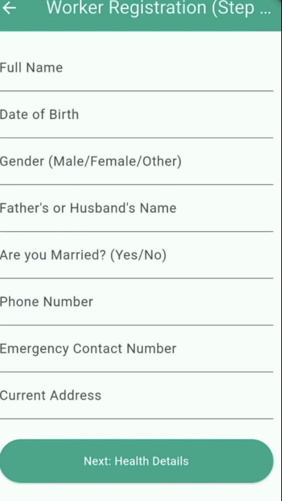
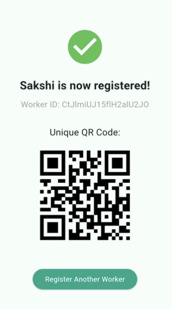
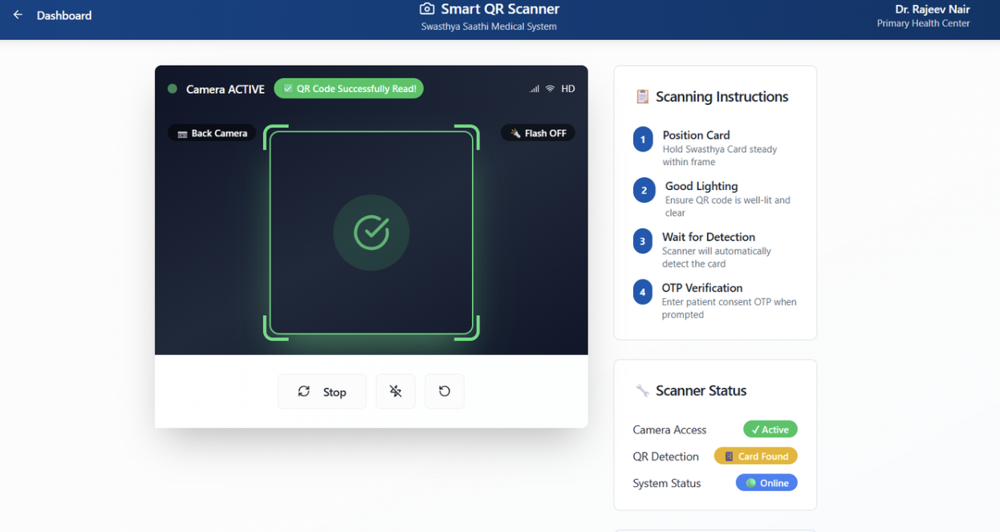
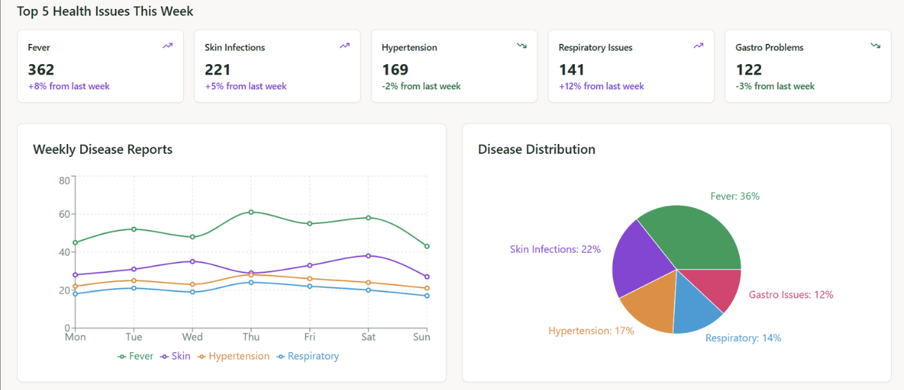

# 🏥 Swasthya Saathi  
### Digital Health Coordination Ecosystem for Migrant Workers

Swasthya Saathi is a multi-role digital health record ecosystem designed to provide continuous, secure, and accessible healthcare for migrant workers in Kerala.

The platform connects workers, doctors, volunteers, and government authorities through a unified health data infrastructure.

---

## 🌍 Problem Statement

Migrant workers face systemic healthcare challenges:

- Language barriers during treatment
- No centralized medical history
- Loss of records due to relocation
- Misdiagnosis due to incomplete information
- Limited access to structured public health systems

These issues result in delayed treatment and poor health outcomes.

---

## 💡 Solution Overview

Swasthya Saathi introduces a four-component ecosystem built on a secure central health database:

### 1️⃣ Sahayak App (Volunteer App – Mobile)

- Worker registration
- Aadhaar QR scanning
- Medical data capture
- Offline-first capability
- Instant ID card generation

Built using **Flutter**

---

### 2️⃣ Swasthya Card (Worker Identity)

- Physical health ID card
- Unique QR code
- No smartphone required for worker
- Enables secure access to records

---

### 3️⃣ Doctor Web Portal

- QR scan to fetch records
- OTP-based consent verification
- Real-time access to full medical history
- Language translation support
- Diagnosis and treatment updates

Built using **React + TypeScript**

---

### 4️⃣ Government Public Health Dashboard

- Aggregated, anonymized health analytics
- Disease trend identification
- Region-based case monitoring
- Policy decision support

---

## 🏗 System Architecture

**Mobile App:** Flutter  
**Web Dashboards:** React + TypeScript  
**Backend API:** Python (Flask)  
**Database:** MongoDB  
**Local Caching:** SQLite  
**Future Scope AI:** OpenCV, MediaPipe  

---

## 🔐 Security & Privacy

- OTP-based consent before record access
- Role-based access control (RBAC)
- Encrypted health record storage
- No open public data exposure

---

## 🔄 End-to-End Workflow

### Step 1 — Worker Registration
Volunteer uses Sahayak App:
- Scan Aadhaar QR
- Capture medical details
- Generate Swasthya Card

### Step 2 — Medical Visit
Doctor:
- Scans QR
- Worker gives OTP consent
- Doctor accesses full history

### Step 3 — Treatment Update
- Doctor updates diagnosis
- Records synced to central DB

### Step 4 — Government Monitoring
- Dashboard reflects anonymized trends
- Authorities detect health clusters

---

## 📸 Application Screenshots

### 📱 Sahayak Registration App


### 🆔 Swasthya Card QR


### 🖥 Doctor Portal Dashboard


### 📊 Government Analytics Dashboard


---

## 🛠 Core Features

- Aadhaar QR Integration
- Offline-first mobile architecture
- Bluetooth card printing support
- Secure OTP-based consent
- Real-time data synchronization
- Health analytics dashboard

---

## 🚀 How to Run

### Backend

```bash
cd backend
pip install -r requirements.txt
python app.py

Flutter App
cd mobile_app
flutter pub get
flutter run

Web Dashboard
cd web_dashboard
npm install
npm start

🌱 Future Scope

AI-based early disease detection

Predictive outbreak modeling

Multilingual chatbot integration

Telemedicine support

🎯 Impact

Swasthya Saathi aligns with:

UN SDG 3 (Good Health & Well-being)

Digital India Healthcare Initiatives

It demonstrates how technology can bridge healthcare accessibility gaps in vulnerable communities.

📌 Project Status

Core functionality implemented for:

Volunteer App

Doctor Portal

Government dashboard analytics module in progress.
